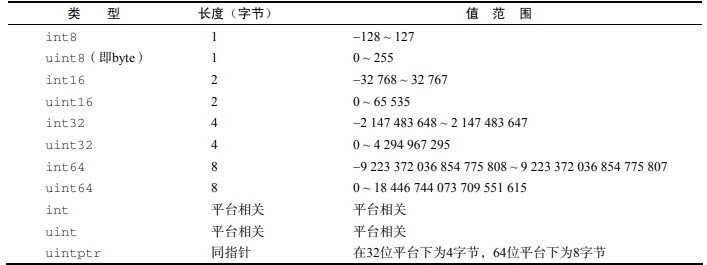
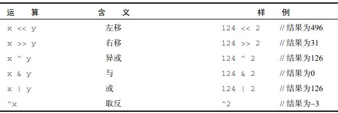
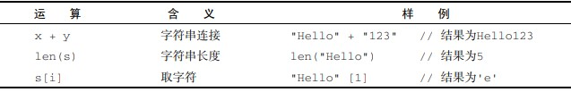

# golang note

## 2019-06-19

### 语言特性
    - 自动垃圾回收
    - 并发编程
    - 多返回值

### 变量
    
```go
        //定义
        var v1 int
        var ar [10] int   //数组
        var arr [] int    //数组切片
        var po *int       //指针
        var m map[string] int   //map key为string类型 value为类型
        var f func(a int) int 

        //初始化 
        var a int = 10;
        var a = 10;
        a := 10     //自动推导

        var b int;
        b := 10
        /*-------------------
        no new variables on left on side of := 
        := 左侧的变量必须为未声明过的
        */

        //赋值
        var a int;
            a=10;

        // 交换
        i,j = j,i

        //匿名变量
        func GetName()(firstName,lastName string){
            return "kobe","bryant"
        }

        _,lastName := GetName();   //只获取 lastName 
 
```

### 常量
- 字面常量
    ```go
            -12
            3.1415994329423424   //浮点类型
            3.2+12i              //复数类型
            true                 //布尔类型
            "foo"                //字符串类型
    ```
- 常量定义
    - 通过 const 关键字
        ```go
            const Pi  float64 = 3.1435235235345235254255523
            const zero = 0.0        //无类型浮点常量
            const (
                size int64 = 1024
                eof = -1
            )                       //无类型整型常量

            const a,b float32 = 0,1    //a=0.0 b=1.0  常量的多重赋值

            const a,b,c = 3,4,"foo"    //a=3 b=4 c="foo" 无类型整型和字符串常量

        ```
    - 预定义常量
        true,false,iota
        iota 可认为是一个可被编辑器修改的常量，在每一个const出现时被重置为0,在下一个const出现之前，每出现一次iota，其代表的数字就会自增1
        ```go
            const (
                a=iota  //a==0
                b=iota  //b==1          
                c=iota  //c==2
            )
            const (
                a=1<<iota   //a==1
                b=1<<iota   //b==2         
                c=1<<iota   //c==4
            )

            const (
                a = iota * 12          //0 
                b float64 = iota * 12  //12.0
                c = iota * 12          //24
            )
            const x iota //0
            const y iota //0
            
            //如果const 的赋值表达式是一样的，可以只保留首个表达式,如前两个例子等同于：
            const (
                a=iota
                b
                c
            )

            const (
                a = 1<<iota
                b,
                c
            )
        ```

### 枚举
- 定义
    - 通过const () 定义一组常量来定义枚举值
        ```go
            const (
                Sunday = iota
                Monday,
                Tuesday
                Wednesday
                Thursday
                Friday
                Saturday
                numberOfDays  //这个常量没有被导出，包内私有
            )

            //同其他符号（symbol）一样 ，大写字母开头的常量在包外可见

        ```
### 类型
- 基础类型
    - 布尔类型：bool
        - 可赋值为预定义的true和false
            ```go
                var v bool
                v = true
                v2 := (1==2)
                //不接受其他类型的赋值，不支持自动或强制类型的转换，如下
                var b bool
                b = 1       //编译报错
                b = bool(1)   //编译报错
            ```
    - 整型： int8,byte,int16,uint16,int32,uint32,int64,uint64,unitptr 等
        
        
        1.  类型表示：
            需要注意的是int和int32为不同类型，编译器不会自动转换，要转换需使用强制类型转换的方式
            ```go
                var val1 int32
                val2 := 64    //int 型
                val1 = val2    //编译出错
                val1 = int32(val2)   //编译通过
            ```
            `强制转需要注意的是精度丢失问题`

        2. 数值运算: + - * / % 
        3. 比较运算： < ,<= , == ,>=,>,!= 

            `两个不同类型的值是不能直接比较，但是各种类型的整型可以与字面常量（literal）进行比较`
            ```go
                    var i int32
                    var j int64
                    i,j = 1,2
                    if i==j {        //编译出错
                        fmt.Println("----");
                    }

                    if i==1 || j ==2 {  //编译通过
                        fmt.Println("----");
                    } 
            ```

        4. 位运算
            


    - 浮点型： 
        
        - float32（等价于 C语言的 float型）,
        - float64 （等价于 C 语言的double型），转换同整型一样需要使用强制类型转换 
        - 比较
            因为浮点数不是一种精确的表达式，不能直接像整型一样使用 == 来判断是否相等，推荐以下方案：
            ```go
                import "math"

                // p 为用户自定义的比较精度 ， 如 0.000001
                func IsEqual(f1,f2,p float64) bool{
                    return math.Fdim(f1,f3) < p 
                }

            ```


    - 复数类型：complex64,complex128
        ```go
            //定义：实部 + 虚部
            var val1 complex64     //由2个float32构成的复数类型
            val1 = 3.2 + 12i
            val2 := 3.2 + 12i     //val2为complex128 类型
            val3 := complex(3.2,12)    //同val2

        ```


    - 字符串： string
        ```go
            var str string
            str = "hello world"
            ch := str[0]    //取字符串第一个字符
            //注： 字符串的内容不能在初始化后被修改 ，如
            str[0] = "x"     //编译出错
        ```
        - 字符串操作：

            
        - 遍历：

            ```go
                str := "hello 世界"
                n := len(str)
                
                //Unicode字符方式遍历，元素值为rune类型
                for i,ch := range str{ 
                    fmt.Println(i,ch)
                }

                //字节数组方式遍历，元素值为byte类型
	            for i:=0;i<len(str);i++ {
		            fmt.Println(i,str[i]);   
	            }

            ```


    - 字符类型：
        - byte (**实际是uint8的别名**) 代表UTF-8字符串单个字节的值
        - rune 代表单个Unicode字符

    - 错误类型： error
    
- 复合类型
    - 指针 pointer
    - 数组 array
        ```go
            [32]byte     //长度为32的数组，每个元素占一个字节
            [2*N] struct {x,y int32}  //复杂类型数组
            [1000]*float64      //指针数组
            [2][3] int         //二维数组
            [2][3][4]float64      //等同于 [2]([3]([4]float64)) 
            
            arrLen := len(arr)    //数组长度len是数组内置常量 
            
        ```
        数组访问:
        ```go
            for i:=0; i<len(arr) ;i++{
                fmt.Println(i,arr[i])
            }

            for i,v := range arr {
                fmt.Println(i,v);     //下标 , 值
            }
        ```

        值类型
        ```go
            func modifyArr(arr [10]int){
                arr[0] = 11
                fmt.Println('modify arr',arr)
            }

            func main(){
                arr := [5]{1,2,3,4,5} 
                modify(arr)        //[11,2,3,4,5]
                fmt.Println('main ',arr);   //[1,2,3,4,5]
            }
            //在go中，数组是一种值类型，所有的值类型变量在赋值和作为参数传递时将产生一次复制动作。如果将数组作为函数的参数类型，则在函数调用时将发生数据复制，因此在函数体中无法修改传入的数组内容,函数体操作的是该参数的一个副本。
        ```
        
    - 切片 slice
    - 字典 map
    - 通道 chan
    - 结构体 struct
    - 接口 interface
    


## 08.07 - 并发编程
- 协程（goroutine） `go`关键字
- 并发通信：
    - 锁（繁琐、臃肿）

- channal 
    - 基本语法：
        - 声明 `chan`关键字添加
        - 定义 make  ,  缓冲机制
    
    - select
        - 处理异步IO
        - case 语句必须是IO操作（读取、写入）
    
    - 超时机制
        - 利用select实现

    - channel 传递
    - 单向channel  , 转换
    - 关闭
        - close
        ```go
            x,ok := <- ch   //于map按键获取类似，ok为bool
        ```    


##  0808

- IPC简单示例 demo编写学习【server端和client端】
    
    包含知识点：
    - 用channel作为模块之间的通信方式